###树梅派

分为rs和e14两个版本，rs是英国版的供应商，e14是中国厂商购买的e洛联授权而生产的。为了方便理解，可以把e14当作中国版的，把rs当作英国版的。两个版本没有显著的区别，甚至中国版的有些比英国版的芯片还高级。

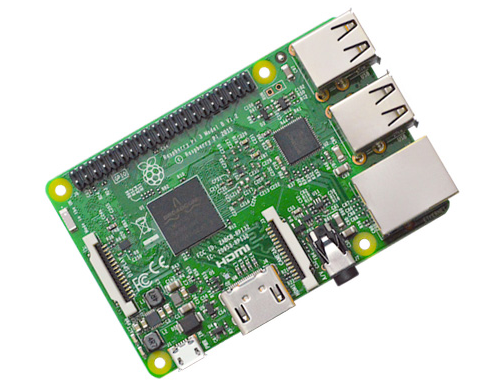

raspbian = raspberry pi + debian

[下载 桌面版 RASPBIAN STRETCH WITH DESKTOP](https://downloads.raspberrypi.org/raspbian_latest)

[下载 终端版 RASPBIAN STRETCH LITE](https://downloads.raspberrypi.org/raspbian_lite_latest)

```
sudo dd if=2017-09-07-raspbian-stretch.img of=/dev/sdb
```

该镜像默认没有开启ssh，需要在磁盘根目录建立一个名为ssh的文件，即可启用ssh。

sdb需要用fdisk -l列出磁盘确认，不要弄错了。

附件：3.5寸 LCD 屏幕驱动
http://www.kedei.net/raspberry/v6_1/LCD_show_v6_1_3.tar.gz


ubuntu-mate

[ubuntu-mate-16.04](https://ubuntu-mate.org/raspberry-pi/ubuntu-mate-16.04.2-desktop-armhf-raspberry-pi.img.xz)

```
sudo apt-get install gddrescue xz-utils
unxz ubuntu-mate-16.04.2-desktop-armhf-raspberry-pi.img.xz
sudo ddrescue -D --force ubuntu-mate-16.04.2-desktop-armhf-raspberry-pi.img /dev/sdx
```

dietpi
```
wget http://dietpi.com/downloads/images/DietPi_RPi-armv6-(Jessie).7z
```

```
7z x DietPi_RPi-armv6-\(Jessie\).7z
```

```
sudo dd if=DietPi_RPi-armv6-\(Jessie\).img of=/dev/sdx
```

username: root password: dietpi


GPIO

nodegpio

[https://www.npmjs.com/package/nodegpio](https://www.npmjs.com/package/nodegpio)

nodejs、shell、python

[https://github.com/makeabignews/gpiopi](https://github.com/makeabignews/gpiopi)

###android things

[https://developer.android.com/things/preview/download.html](https://developer.android.com/things/preview/download.html)

###c-sky

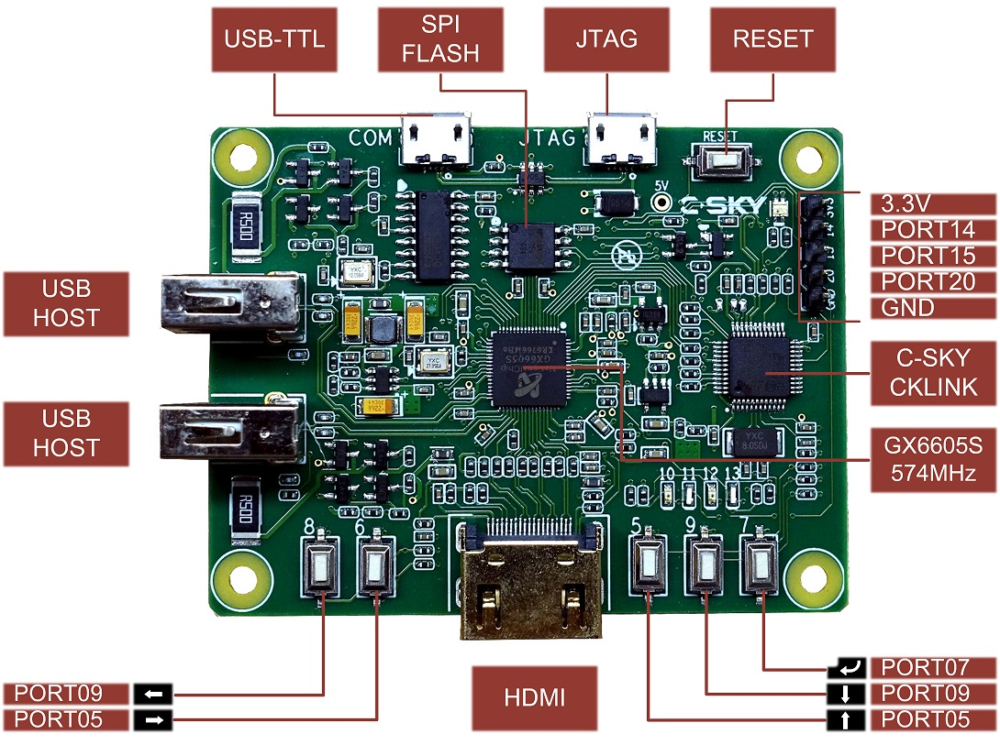

c-sky是国产自主指令集的CPU，能使用python开发。

[taobao](https://item.taobao.com/item.htm?spm=a230r.1.14.16.59a45c7e8Swe89&id=556322544984&ns=1&abbucket=1#detail)

[https://c-sky.github.io](https://c-sky.github.io)

###香橙派

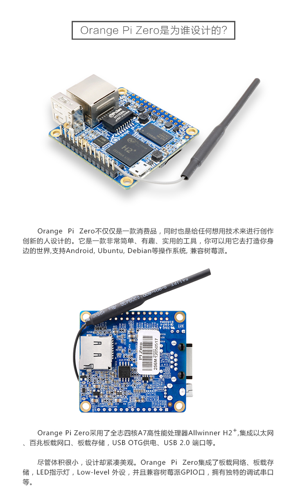

[legacy](https://dl.armbian.com/orangepizero/Ubuntu_xenial_default.7z)
[mainline](https://dl.armbian.com/orangepizero/Ubuntu_xenial_next.7z)

root/1234

[DietPi](http://dietpi.com/downloads/images/DietPi_OrangePiZero-armv7-(Jessie).7z)

[DietPi on github](https://github.com/Fourdee/DietPi)

username: root password: dietpi

小贴士：
别用图形化工具去烧录tf卡，用dd命令才能启动～ （原因未知）

```
sudo dd if=DietPi_v145_OrangePiZero-armv7-\(Jessie\).img of=/dev/sda
记录了907264+0 的读入
记录了907264+0 的写出
464519168 bytes (465 MB, 443 MiB) copied, 115.507 s, 4.0 MB/s

```

最好能在你的局域网管理界面里看到你的设备，否则单纯扫描22端口是无法发现ssh的。另外该板子的启动速度很慢，通电后登上2分钟再登陆。

如果开启了热点，默认ip是192.168.42.1

###香蕉派

有些小贵的香蕉派，是高端品牌，配置也很高。

###NodeMCU

esp8266低成本的开发板，广泛用于IOT。

###micro：bit

面向小朋友的开发板，可以使用python和block积木语言来编程。

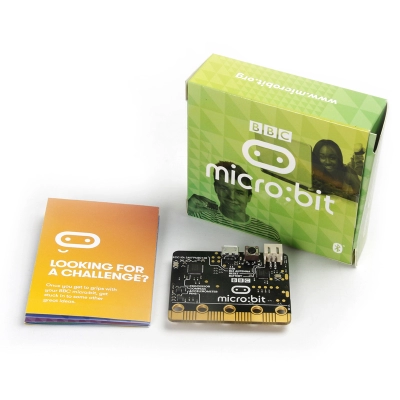

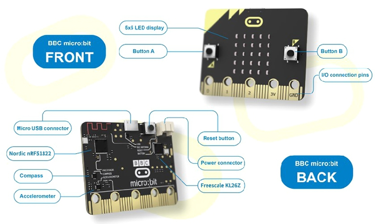

[microbit官方网站](http://www.microbit.org/)

[microbit课程](http://www.microbit.org/en/2017-03-07-javascript-block-resources/)

[microbitPython课程](http://microbit-micropython.readthedocs.io/en/latest/tutorials/hello.html)

[microbit项目](https://makecode.microbit.org/projects)

##其他开发板

###Udoo quad

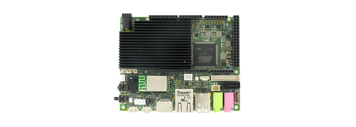

###NanoPi Duo


###Le Potato

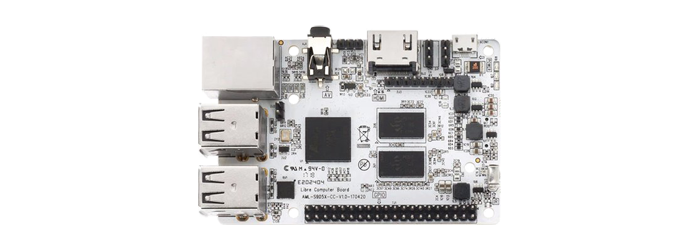

###Odroid HC1


###Tinkerboard

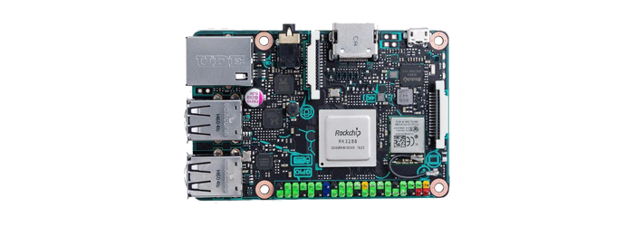

###SoPine64

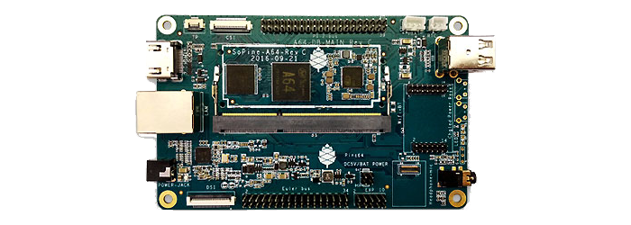

###MiQi

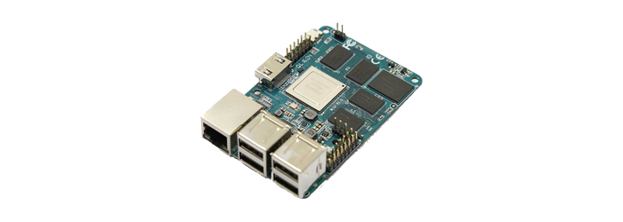

###pcDuino2
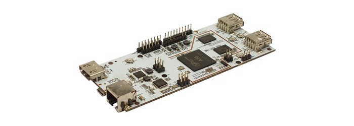