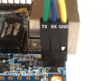

# Expansion Port

The Orange Pi Zero has a 26-pin, 0.1" unpopulated connector with several low-speed interfaces.


[](http://linux-sunxi.org/File:Orange_Pi_Zero_Expansion_Header.jpeg)

| 2x13 Header |                           |      |                                   |
| ----------- | ------------------------- | ---- | --------------------------------- |
| 1           | *3.3V*                    | 2    | *5V*                              |
| 3           | TWI0_SDA / PA12 / GPIO12  | 4    | *5V*                              |
| 5           | TWI0_SCK / PA11 / GPIO11  | 6    | *GND*                             |
| 7           | PWM1 / PA06 / GPIO6       | 8    | UART1_TX / PG06 / GPIO198         |
| 9           | *GND*                     | 10   | UART1_RX / PG07 / GPIO199         |
| 11          | UART2_RX / PA01 / GPIO1   | 12   | SIM_CLK/PA_EINT7 / PA07 / GPIO7   |
| 13          | UART2_TX / PA00 / GPIO0   | 14   | *GND*                             |
| 15          | UART2_CTS / PA03 / GPIO3  | 16   | TWI1-SDA / PA19 / GPIO19          |
| 17          | *3.3V*                    | 18   | TWI1-SCK / PA18 / GPIO18          |
| 19          | SPI1_MOSI / PA15 / GPIO15 | 20   | *GND*                             |
| 21          | SPI1_MISO / PA16 / GPIO16 | 22   | UART2_RTS / PA02 / GPIO2          |
| 23          | SPI1_CLK / PA14 / GPIO14  | 24   | SPI1_CS / PA13 / GPIO13           |
| 25          | *GND*                     | 26   | SIM_DET/PA_EINT10 / PA10 / GPIO10 |

The Orange Pi Zero has another 13-pin, 0.1" header with several low-speed interfaces.

| 1x13 Header |                                      |
| ----------- | ------------------------------------ |
| 1           | *5V*                                 |
| 2           | *GND*                                |
| 3           | USB-DM2                              |
| 4           | USB-DP2                              |
| 5           | USB-DM3                              |
| 6           | USB-DP3                              |
| 7           | LINEOUTR                             |
| 8           | LINEOUTL                             |
| 9           | TV-OUT                               |
| 10          | MIC-BIAS                             |
| 11          | MIC1P                                |
| 12          | MIC1N                                |
| 13          | [CIR](http://linux-sunxi.org/CIR)-RX |


###串口调试


```
sudo picocom /dev/ttyUSB0 -b 115200
```